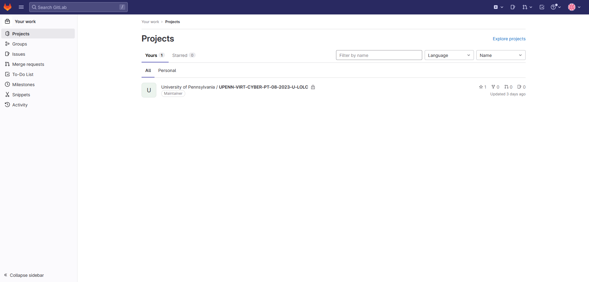
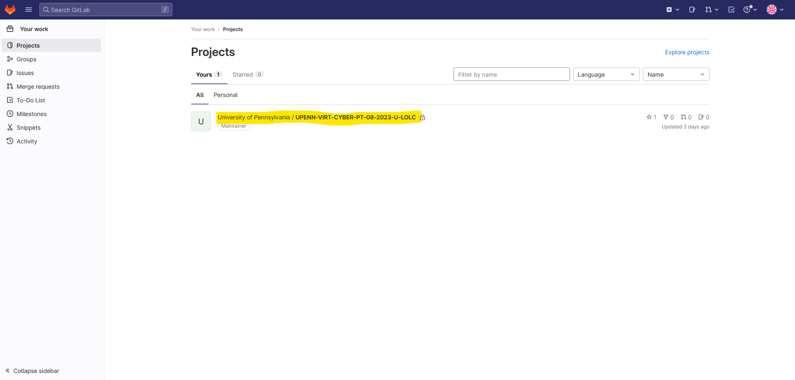

# How to Access the Class Gitlab Repo

## Prerequisite Steps (REQUIRED)

  <ul>
    <li>Make a GitLab account via the link you received in an email from the SSM.
  </ul>

## Step 1: 
### Head over to https://git.bootcampcontent.com/ and log in

## Step 2: 
### Enter the project for our class

## Lesson Plans: 
### Lesson Plans and activity files are located in Lesson-Plans
#### They are sorted based on week as well as day

## Lesson Slides: 
### Lesson slides in Powerpoint format are located in Lesson-Slides

